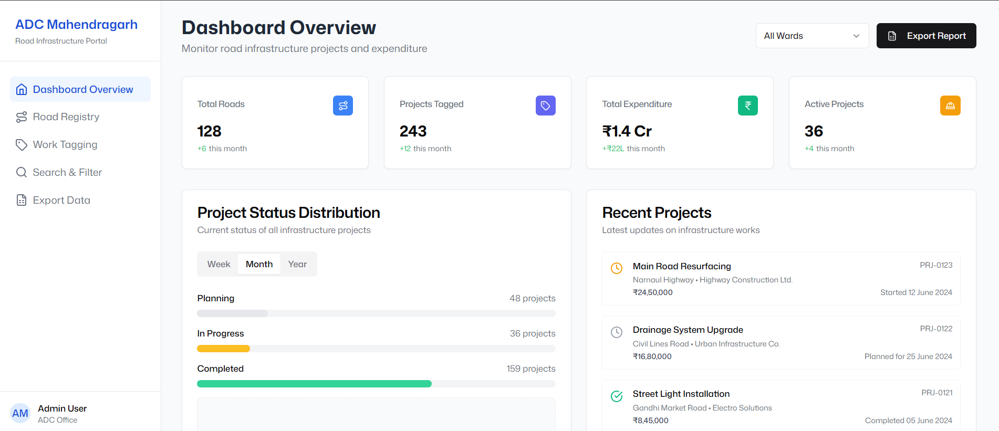

# Roadmap360 - Road Infrastructure Dashboard - C4GT 2025

A modern, admin-friendly dashboard for "Road Nomenclature & Infra Monitoring Dashboard" for ADC Mahendragarh. This application helps manage and monitor road infrastructure projects, track expenditures, and generate reports.



## 🚀 Features

- **Road Registry Management**: Add, edit, and manage road information
- **Work Tagging**: Tag development work to registered roads
- **Search & Filter**: Advanced search and filtering capabilities
- **Data Export**: Export data in various formats for reporting
- **User Authentication**: Secure login and role-based access control
- **Responsive Design**: Works on desktop, tablet, and mobile devices

---

## 🧪 UI Prototype

An initial working prototype has been created using V0.dev, demonstrating the complete workflow—from registering roads with unique IDs to tagging infrastructure development and monitoring progress

🔗 **[View UI Prototype](https://kzmg27dspcyevsl5qtkg.lite.vusercontent.net/dashboard)**


## 🛠️ Technology Stack

- **Frontend**: Next.js, React, TypeScript, Tailwind CSS, shadcn/ui
- **Backend**: Next.js API Routes
- **Database**: MongoDB with Mongoose
- **Authentication**: NextAuth.js
- **Form Validation**: Zod
- **Logging**: Winston

## 📋 Prerequisites

- Node.js 18.x or higher
- MongoDB instance (local or cloud)
- npm or yarn

## 📖 How to Run

```bash
git clone https://github.com/ManoharBari/Roadmap360.git
cd Roadmap360
npm install
npm run dev
```

## 🧑‍💻 Author

**Manohar Kale**
Full Stack Developer – MERN | CivicTech Contributor

🔗 [GitHub](https://github.com/manoharbari) • [LinkedIn](https://linkedin.com/in/manohar-kale)
